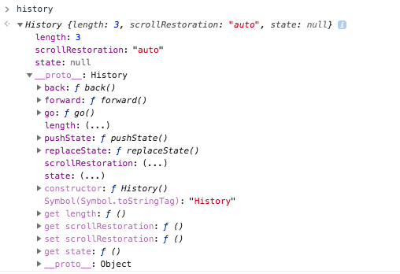

# HTML5 history

HTML5 history helps you to change URL and webpage resources without refreshing webpage.

reference: https://juejin.im/post/5aebc4a26fb9a07acc11924d

## properties and methods for history object



### methods

- back
- forward
- go

```javascript
let historyIndex = 10
hisotry.go(historyIndex)
```

### New methods added for history object in html5

- pushState: add a new history record without refreshing webpage

- replaceState: replace current URL without a refreshing webpage

Both *replaceState* and *pushState* will change browser URL, but it does not load the page.

A demo is [here](./index.html)

```javascript
var $pushBtn = document.querySelector('.btn-push')
$pushBtn.addEventListener('click', function () {
  history.pushState(null, null, './demo.html')
})
```

## events for html5 history

### popstate

**popstate** event triggered when there is a change for URL(not works for **pushState** and **replaceState**)

### hashchange

**hashchange** event triggered when there is a change for URL's hash(not works for **pushState** and **replaceState**)

[loadContent.html](./loadContent.html) is an example about **popstate** and **hashchange**.