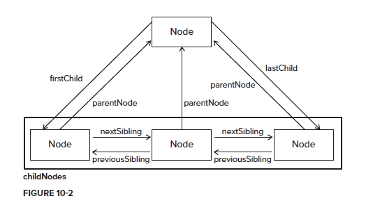

# The Document Object Modle

## DOM hierarchy
Any HTML or XML document can be
represented as a hierarchy of nodes using the
DOM. <br>

Consider the following html file, 
```html
<html>
  <head>
  <title>Sample Page</title>
  </head>
  <body>
    <p>Hello World!</p>
  </body>
</html>
```
the dom hierarchy can be illurstrated as
.<br><br>


## Node Type
Node can be accessed at **window** Object. All the node types are constants and binded on **Node.prototype**.
<br>
.

All the HTML Node is a instance of Node Class and they have a **nodeType** property.

```javascript
console.log(`document is a instance of Node: ${document instanceof Node}`)

console.log(`document.nodeType: ${document.nodeType}`)
```
<br>

#### some most usuaslly used node types
- Node.ELEMENT_NODE(1) (html node)
- Node.ATTRIBUTE_NODE (2) (attribute node)
- Node.TEXT_NODE (3)  (text node)
- Node.COMMENT_NODE (8) (comment node)
- Node.DOCUMENT_NODE(9) (document node)
- Node.DOCUMENT_FRAGMENT_NODE (11) (document fragment)
<br>

#### The nodeName and nodeValue Properties
***For elements, nodeName is always equal to the element’s tag name, and nodeValue is always null.***

```javascript
console.log(document.body.nodeName)
console.log(document.nodeName)
console.log(document.documentElement.nodeName)
```


## Node Relationships

.<br>

As all the html node is an instance of **Node** Class. so some properties and functions of a node can be reckoned from **Node.prototype**. <br>

- **ChildNodes**
<br>Each node has a property **childNodes** which contains a NodeList. NodeList is an array-like object used to store an ordered list of nodes that are accessible by position.<br>
It is often said that a NodeList is a living, breathing object rather than a snapshot of what happened at
the time it was first accessed.<br>
- **parentNode**
- nextSibling, previousSibling
- nextElementSibling, previousElementSibling
- firstChild, lastChild
- firstElementChild, lastElementChild
- children (only contains element child)
- Detect a node has child node or not
```javascript
someNode.hasChildNodes()
```
- contains
```javascript
document.contains(document.body)
```
<br><br>

## Manipulating Nodes
### Create element, textNode, comment and attribute
- document.createElement
- document.createDocumentFragment
- document.createTextNode
- document.createComment
- document.createAttribute

<br>
### Locate an element
Quickly find element on document node
- document.head
- document.documentElement, document.body
- document.forms (all the form elements)
- document.anchors (contain all a html tag with an attribute name on it.)
<br>

Some dom access functions
- document.getElementById
- document.querySelector
- document.querySelectorAll
- document.getElementsByClassName
- document.getElementsByTagName
- document.getElementsByName
<br>

Get the attributes of a node
- node.getAttribute
- node.className
- node.classList
- node.id
- node.name
- node.value
- node.innerText, node.innerHTML, node.outerText
<br>

### manipulating nodes
- appendChild
- replaceChild
- insertBefore
- insertAfter
- cloneNode


# Working with the DOM

## Dynamic load css and js script
Please referer to 
- <a href="./05.01.load script.html">load script.html</a>
- <a href="./05.02.load style.html">load style.html</a>
<br>

**NodeList, HTMLCollections and NameNodeMap are dynamic**, which means they are responsive to dom change. In reality, all NodeList objects are queries that
are run against the DOM document whenever they are accessed. <br>

Generally speaking, it is best to limit the number of times you interact with a NodeList. Since a query
is run against the document each time, try to cache frequently used values retrieved from a NodeList.
