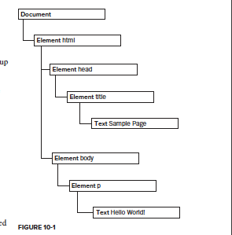
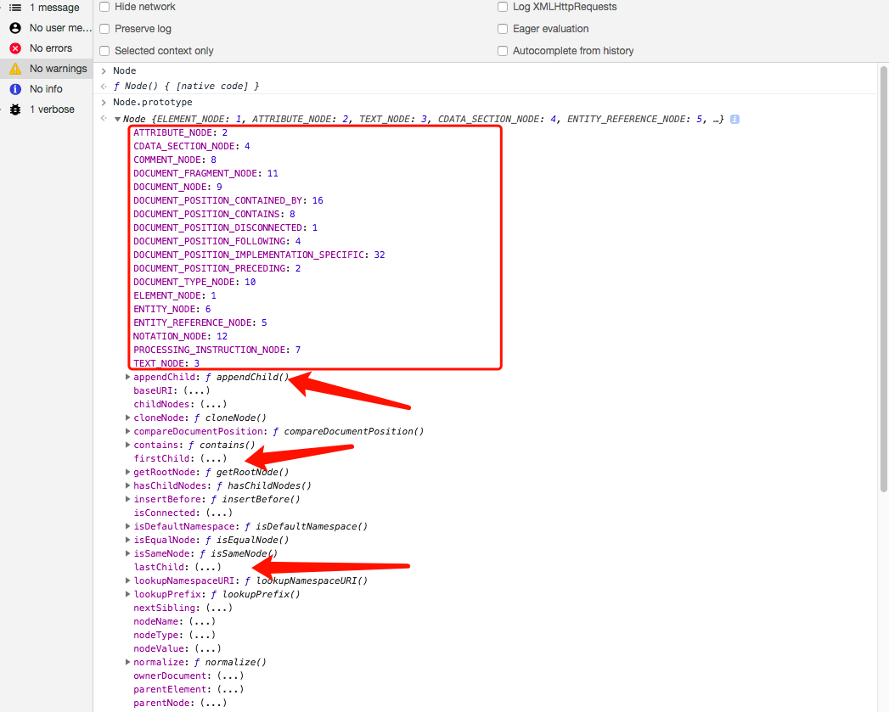

# The Document Object Modle

## DOM hierarchy
Any HTML or XML document can be
represented as a hierarchy of nodes using the
DOM. <br>

Consider the following html file, 
```html
<html>
  <head>
  <title>Sample Page</title>
  </head>
  <body>
    <p>Hello World!</p>
  </body>
</html>
```
the dom hierarchy can be illurstrated as
.<br><br>


## Node Type
Node can be accessed at **window** Object. All the node types are constants and binded on **Node.prototype**.
<br>
.

#### some most usuaslly used node types
- Node.ELEMENT_NODE(1) (html node)
- Node.ATTRIBUTE_NODE (2) (attribute)
- Node.TEXT_NODE (3)  (text node)
- Node.COMMENT_NODE (8) (comment node)
- Node.DOCUMENT_NODE(9) (document node)
- Node.DOCUMENT_FRAGMENT_NODE (11) (document fragment)


