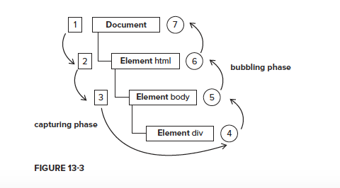

# Event
## Event Flow
The event flow specified by DOM Level 2 Events has three phases: the event capturing phase, at the target, and the event bubbling phase.



## Event Handlers
Events are certain actions performed either by the user or by the browser itself. These events have
names like click, load, and mouseover. A function that is called in response to an event is called
an **event handler (or an event listener)**. <br>

#### DOM0 Level Event Handler
```javascript
window.onload = function (e) {
  // this points to window
  console.log(this)
  console.log(e)
}
document.body.onclick = function (e) {
  // this points to document.body
  console.log(this)
  console.log(e)
}
// remove event handler

document.body.onclick = null
```
<br>

#### DOM Level 2 Event Handlers
DOM Level 2 Events define two methods to deal with the assignment and removal of event handlers: **addEventListener()** and **removeEventListener()**. **(addEventListener and removeEventListener are compatible with IE9 and later)** <br>

```javascript
var sayHi = function () {
  console.log('hi')
}

/*
element.addEventListener(type: DOMString, callback: EventListener, capture?: boolean)
capture: true, event handler will excute at capture phase
capture: false, event handler will exture at bubble phase
*/

document.addEventListener('click', sayHi, false)
document.removeEventListener('click', sayHi, false)
```

For IE8 and previous version, ** attachEvent ** and ** detachEvent ** take over the same functionality as ** addEventListner ** and ** removeEventListener ** with the same params.
The differences is ** attachEvent ** and ** detachEvent ** only support event bubbling phase.

```javascript
var sayHi = function () {
  console.log('hi')
}
document.body.attachEvent('click', sayHi)
document.body.detachEvent('click', sayHi)
```
<br>

Compared with DOM0 Level event mechanism, DOM2 Level event mechanism enables mutitiple handlers binding. It's a smilarity to *** subscriber publisher *** pattern. Here is a simplified example of publisher and publisher code.

```javascript
const event  = {
  events: {},
  listen: function (key, fn) {
    if (!this.events[key]) {
      this.events[key] = []
    }
    this.events[key].push(fn)
  },
  // rest param is an array
  trigger: function (key, ...rest) {
    if (this.events[key]) {
      let fns = this.events[key]
      for (let i = 0, len = fns.length; i < len; i++) {
        let fn = fns[i]
        if (typeof fn === 'function') {
          fn.apply(this, rest)
        }
      }
    }
    return false
  }
}

function sayHello () {
  console.log('hello')
}

// sayHello is a subscriber
event.listen('hello', sayHello)
// event is a publisher
event.trigger('hello')

```
<br><br>


## Event Object
When an event related to the DOM is fired, all of the relevant information is gathered and stored
on an object called event. An event object is an instance of **Event** class. <br>

We can acess Event object from chrome's console panel. By **Event.prototype**, we can have a quick look the properties of a event object. <br>

<br>

- eventPhase, event handler excuted phase (1:capturing phase, 2: at targe, 3: bubbling phase)
- target, srcElement the element which triggers the event
There is no srcElement for firefox browser while there is no target for IE browser. A compatible solution is 
```javascript
let {target, srcElement} = e
let tarEle = target || target
```
- currentTarget, current target. It points to its current event handler's 
- type, event type

<br><br>


## Event Types
There are numerous categories of events that can occur in a web browser. As mentioned previously,
the type of event being fired determines the information that is available about the event. DOM
Level 3 Events specifi es the following event groups:
- User interface (UI) events are general browser events that may have some interaction with the BOM.
- Focus events are fired when an element gains or loses focus.
- Mouse events are fired when the mouse is used to perform an action on the page.
- Wheel events are fired when a mouse wheel (or similar device) is used.
- Text events are fired when text is input into the document.
- Keyboard events are fired when the keyboard is used to perform an action on the page.
- Composition events are fired when inputting characters for an Input Method Editor (IME).
Mutation events are fired when a change occurs to the underlying DOM structure.


### UI Events
- load
- abort
- error
- select
- resize
- scroll
<br>

To determine if a browser
supports HTML events according to DOM Level 2 Events, you can use the following code:
```javascript
var supportDom2 = document.implementation.hasFeature('HTMLEvents', '2.0')
var supportDom3 = document.implementation.hasFeature('UIEvent', '3.0')
```

#### load event
- for window, load event fires at when all the document resource are loaded
- for javascript/css/img tag, load event fires at when the resource are loaded
<br>

How to load script/css/img dianomically, please check <a href="./06.load event and DOMContentLoaded event.html">load css/js/img</a>. <br>

After all the resources loaded, the load event for window can be fired automatically.<br>

#### DOMContentLoaded
The **DOMContentLoaded** event is fired when the initial HTML document has been completely loaded and parsed, without waiting for stylesheets, images, and subframes to finish loading.<br>

DOMContentLoaded is fired before load event. <br>

How to realize a **$(document).ready** function?  Here is a basic solution.
```javascript
function ready (callback) {
  // in case the document is already rendered
  if (document.readyState !== 'loading') {
    return callback()
  }
  else if (document.addEventListener) {
    document.addEventListener('DOMContentLoaded', callback, true)
  }
  else {
    // IE <= 8
    document.attachEvent('onreadystatechange', function(){
      if (document.readyState=='complete') callback()
    })
  }
}
```
<br>

#### resize event
<a href="./08.resize event.html">resize event</a> <br>

#### scroll event
Even though the scroll event occurs on the window, it actually refers to changes in the appropriate
page-level element. In quirks mode, the changes are observable using the scrollLeft and
scrollTop of the <body> element; in standards mode, the changes occur on the <html> element in
all browsers except Safari (which still tracks scroll position on <body>). For example:<br>

<a href="./09.scroll event.html">scroll event</a> <br>

#### Mouse Event
Mouse events are the most commonly used group of events on the Web, because the mouse is the
primary navigation device used. There are nine mouse events defi ned in DOM Level 3 Events. <br>

- mousedown
- mouseup
- click
- dblclick
For click event, the trigger order is mousedown, mouseup and click. <br>

For dblclick event, trigger order is mousedown, mouseup, click, mousedown, mouseup, click and dblclick. <br>

- mouseover
- mouseout
- mouseenter
- mouseleave
For mouseover and mouseout, they are event group,meanwhile; for mouseenter and mouseleave, the are another event group.<br>

#### pageX, pageY, clientX, clientY
```javascript
let { pageX, pageY, clientX, clientY } = e
let scrollTop = 0

if (document.compatMode === 'CSS1Compat') {
  scrollTop = document.documentElement.scrollTop
} else {
  scrollTop = document.body.scrollTop
}
console.log((pageY === (clientY + scrollTop)))
```
For example, please click <a href='./11.2.pageX, pageY, clientX, clientY.html'>11.2.pageX, pageY, clientX, clientY.html</a>

